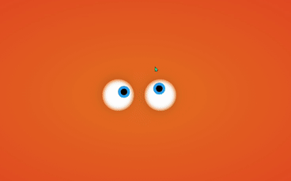

<h1 align="center">
    EYE-CRAZY
</h1>

<p align="center">
    <a href="#Tecnologias">Tecnologias</a>&nbsp;&nbsp;&nbsp;|&nbsp;&nbsp;&nbsp;
    <a href="#Projeto">Projeto</a>&nbsp;&nbsp;&nbsp;
</p>

## Tecnologias

    Esse projeto foi desenvolvido com as seguintes tecnologias:

- [HTML5](https://www.w3schools.com/html/default.asp)
- [CSS](https://www.w3schools.com/css/default.asp)
- [Javascript](https://www.w3schools.com/js/default.asp)

<br />

## Projeto

    Desenvolvido aplicação em html5, utiliznado javascript e css 💜


<br />

> Html
```HTML
    <body>
        <div class="box">
            <div class="eye"></div>
            <div class="eye"></div>
        </div> 
    </body>
```

> Código Javascript
```Javascript
    <script>
        document.querySelector('body').addEventListener('mousemove', eyeball);

        function eyeball(event) {
            const eye = document.querySelectorAll('.eye');
            
            eye.forEach(function(eye) {
            
            let x = (eye.getBoundingClientRect().left) + (eye.clientWidth / 2);
            let y = (eye.getBoundingClientRect().top) + (eye.clientHeight / 2);

            let radian = Math.atan2(event.pageX - x, event.pageY - y);
            let rotation = (radian * (180 / Math.PI) * -1) + 270;
            eye.style.transform = "rotate("+rotation+"deg)"                

            });
        }
    </script>
```

<br />

# Resultado

<h1 align="center">
    
</h1>
